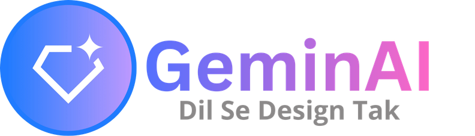
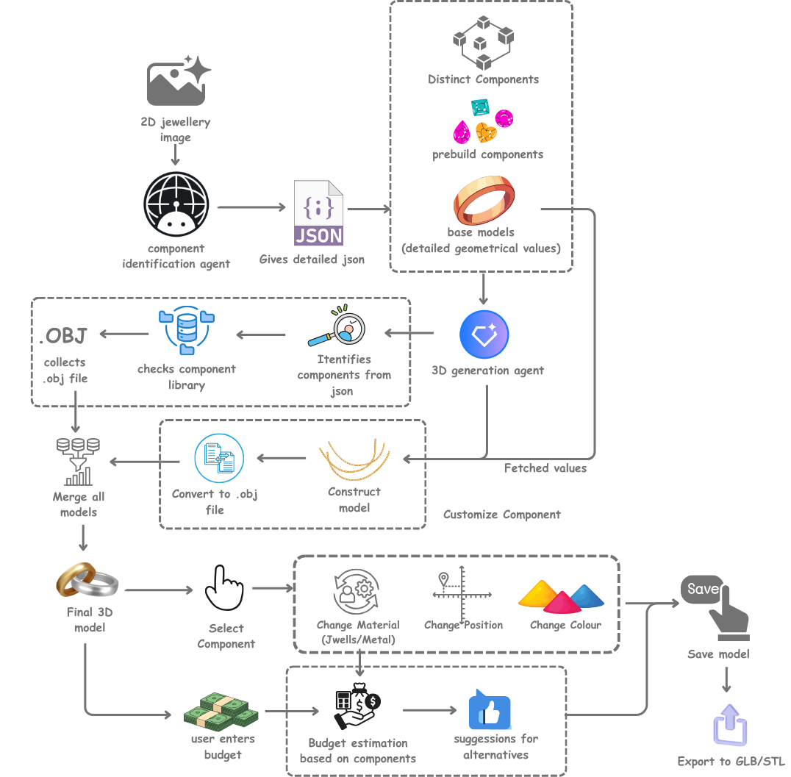
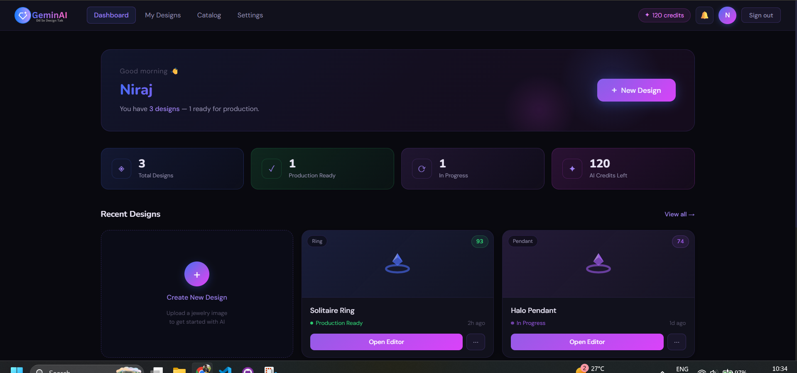
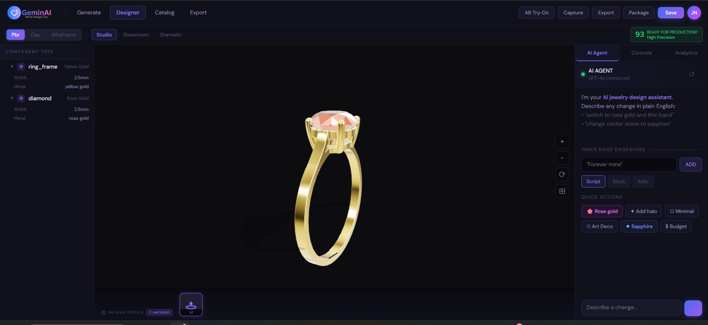
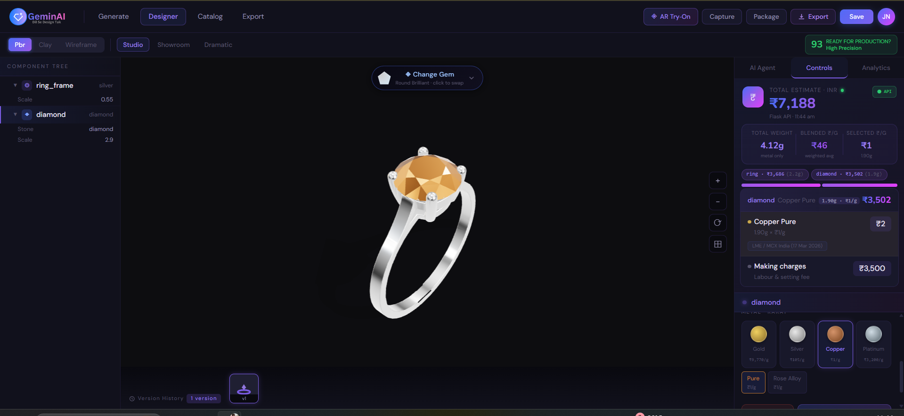

# GeminAI – Dil se Design Tak

  

## Overview

GeminAI is an AI-powered system that converts 2D jewelry images into production-ready 3D models using a segmentation-driven, component-based reconstruction pipeline.

The system separates gemstones and base metal using AI, generates the metal structure through a 2D-to-3D model, and reconstructs the final design using a parametric JSON scene and reusable component library.

This enables low-latency rendering, real-time customization, and accurate component placement, making the system practical for both design and retail workflows.

---

## Problem Overview

Generative AI tools can easily create 2D jewelry designs, but converting them into accurate, manufacturable 3D models remains difficult.

Current workflows suffer from several limitations:

- Converting flat jewelry images into structurally valid 3D geometry is complex.
- Small design changes (metal type, gemstone replacement) often require manual CAD editing.
- Many systems treat jewelry as a single mesh, making component-level editing impossible.
- Re-running generative models for every modification results in high latency and computational cost.

---

## Our Solution

  

GeminAI solves this by introducing a **segmentation-driven, component-based AI pipeline**.

Instead of generating a single mesh, the system:

1. Segments the input image into base metal and gemstone components.
2. Generates a 3D mesh from the isolated metal structure using a 2D-to-3D model.
3. Maps gemstones from a prebuilt asset library and computes accurate placement coordinates.
4. Converts everything into a parametric JSON scene representation.
5. Reconstructs and renders the jewelry using Three.js with real-time customization support.

This enables fast rendering, modular editing, and realistic previews suitable for both designers and retail environments.

---

## How It Works (Pipeline)

| Step | Description |
|------|-------------|
| **Step 1 – Image Input** | User uploads a 2D jewelry image. |
| **Step 2 – AI Segmentation** | The image is segmented into base metal structure and gemstones/decorative components. |
| **Step 3 – Base Metal Extraction** | Gems and stones are removed to isolate the pure metal structure. |
| **Step 4 – 2D → 3D Conversion** | The cleaned base metal image is passed to Hunyuan 2.0 to generate a 3D mesh (.OBJ). |
| **Step 5 – Component Mapping** | Gemstones are mapped from a predefined asset library (diamonds, pearls, etc.). |
| **Step 6 – Position Estimation** | A positioning agent compares the original and base metal images to compute centroid-based coordinates for accurate placement. |
| **Step 7 – JSON Scene Generation** | All components (metal + stones) are structured into a parametric JSON describing geometry, position (x, y, z), scale, and material. |
| **Step 8 – 3D Reconstruction & Rendering** | The final model is assembled in the frontend using Three.js. |

---

## Agent-Based Architecture

The system uses specialized agents for modular processing:

| Agent | Responsibility |
|-------|---------------|
| **Segmentation Agent** | Extracts components from the input image |
| **Reconstruction Agent** | Handles base metal 3D generation |
| **Positioning Agent** | Computes accurate placement of gemstones |
| **Cost Agent** | Calculates real-time pricing |

This improves scalability, maintainability, and modular upgrades.

---

## Performance Optimization

To reduce latency, GeminAI uses a **RAG-based caching mechanism**:

- Generated base metal meshes and embeddings are stored in a vector database.
- When a similar design is uploaded, the system retrieves the closest match and reuses the existing 3D model instead of recomputing.

| Scenario | Latency |
|----------|---------|
| New structure | ~1 minute |
| Cached structure | ~5 seconds |

---

## Core Features

### 1. AI-Based Segmentation
Automatically separates gemstones from the base metal structure, enabling independent processing of each component.

### 2. Base Metal 2D → 3D Generation
The isolated metal image is passed to Hunyuan 2.0 to produce an accurate 3D mesh, preserving proportions and structural integrity.

### 3. Component Recognition
AI detects and classifies components including:
- Gemstones
- Bands
- Prongs
- Settings
- Decorative elements

### 4. Accurate Centroid-Based Placement
A positioning agent computes precise (x, y, z) coordinates for each gemstone using centroid comparison between the original and metal-only images.

### 5. Real-Time Customization
Users can modify:
- Gemstone type and shape
- Metal material and surface finish
- Colors
- Component position and size

All updates happen without regenerating the full model.

### 6. Prebuilt Component Library
A reusable asset library containing:
- Diamonds
- Pearls
- Prongs
- Settings
- Metal bands

Using reusable components significantly reduces rendering time and latency.

### 7. Low Latency via RAG-Based Caching
Previously generated structures are stored and retrieved from a vector database, reducing repeat generation time from ~1 minute to ~5 seconds.

### 8. Live Cost Estimation
Dynamic pricing based on gemstone type, metal type, and component sizes, enabling real-time budget-aware design decisions.

### 9. Exportable 3D Models
Generated models can be exported in:
- **OBJ / GLB** – for real-time rendering and sharing
- **STL** – for manufacturing and CAD workflows
- **PNG** – for high-quality previews

### 10. Save, Reload & Version History
Designs can be saved, reloaded, and versioned for iterative workflows.

---

## Real-Time Customization

Users can modify the design interactively in a 3D studio environment:

- Adjust position (x, y, z)
- Change gemstone types and shapes
- Switch metal materials and finishes
- Resize components

All updates happen without regenerating the full model.

---

## Cost Estimation Engine

The system provides dynamic pricing based on:
- Metal type and weight
- Gemstone type and size
- Component composition

This allows users to make design decisions based on budget in real time.

---

## Tech Stack

| Layer | Technologies |
|-------|-------------|
| **Frontend** | React.js, Three.js / React Three Fiber, Drei |
| **Backend** | Python, Flask API |
| **AI & Image Processing** | Gemini Vision API, Hunyuan 2.0, PIL |
| **3D Assets & Rendering** | OBJ model library, Parametric JSON scene format |
| **Vector Database** | RAG-based caching for mesh retrieval |
| **Output** | OBJ, GLB, STL, PNG |

---

## Key Innovations / USP

- **Segmentation-Driven Pipeline** – AI separates metal and gemstone layers before 3D reconstruction.
- **Intelligent Component Detection** – AI identifies structural jewelry elements directly from images.
- **Smart Geometry Inference** – The system estimates depth and structure required for realistic 3D reconstruction.
- **Centroid-Based Positioning** – Accurate placement of gemstones using coordinate inference from segmented layers.
- **Parametric Component Modeling** – Jewelry parts are generated with adjustable parameters: size, shape, and placement.
- **Component-Based Reconstruction** – Models are assembled using reusable components instead of regenerating full meshes.
- **RAG-Based Caching** – Previously generated structures are retrieved from a vector database to minimize recomputation.
- **Low Latency Editing** – Real-time updates allow instant design iteration.
- **Budget-Aware Customization** – The system recommends alternative materials or gemstones based on a specified budget.
- **Real-Time Cost Estimation** – Dynamic pricing based on gemstone type, metal type, and component sizes.

---

## What Makes This Different

- Does not regenerate full meshes for edits — uses component-level reconstruction instead of monolithic modeling.
- Combines AI segmentation + geometry inference + reusable assets in a single pipeline.
- RAG-based caching reduces repeat generation latency by ~12×.
- Optimized for real-world usability (speed + customization), not just generation quality.
- AR/VR-ready visualization pipeline for immersive previews.

---

## Implementation Screenshots

<table>
  <tr>
    <td></td>
    <td></td>
  </tr>
  <tr>
    <td></td>
    <td></td>
  </tr>
  
</table>

### ✅ Completed
- 2D image input and AI segmentation (metal + gemstone separation)
- Base metal 2D → 3D mesh generation via Hunyuan 2.0
- Prebuilt 3D component library (OBJ models)
- Centroid-based gemstone position estimation
- Component-based 3D reconstruction via parametric JSON
- Interactive customization (position, size, materials)
- RAG-based caching with vector database
- Live cost estimation engine
- Model export (OBJ / GLB / STL / PNG)
- Save, reload, and version history support

### 🔮 Future Work
- **Complex Geometry Handling** – Improve support for intricate and overlapping jewelry designs.
- **Expanded Component Library** – Add more gemstone cuts, prongs, chains, pendants, and earring types.
- **Improved Segmentation** – Enhance accuracy for overlapping or tightly packed components.
- **Enhanced AR/VR Try-On** – Build immersive AR/VR preview experience for retail use.
- **Smarter Budget Recommendations** – Suggest alternative gemstones or metals automatically based on user budget.
- **Enhanced JSON Scene Representation** – Improve scene structure for higher reconstruction accuracy.

---

## Potential Applications

- Jewelry design studios
- Custom jewelry retailers
- Online jewelry visualization
- Manufacturing and prototyping pipelines
- AR/VR jewelry preview systems

---

**Built with ❤️ Team INSPIRE**
